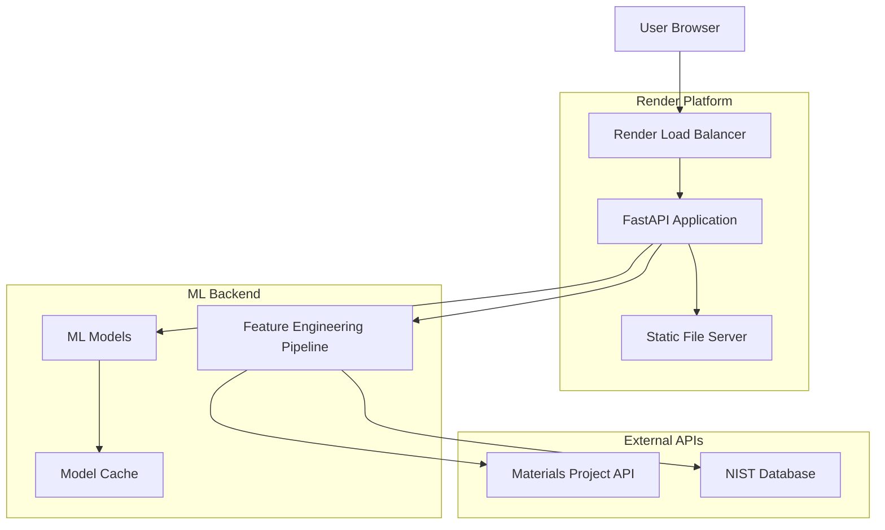

# Design Document

## Overview

This design outlines the migration from Streamlit to a FastAPI-based web application deployed on Render. The new architecture will provide a professional REST API backend with a modern HTML/JavaScript frontend, offering better performance, scalability, and integration capabilities for the ceramic armor ML prediction system.

## Architecture

### High-Level Architecture



### Deployment Architecture

The application will be deployed as a single Render web service with the following components:

1. **FastAPI Backend**: RESTful API server handling predictions and data processing
2. **Static Frontend**: HTML/CSS/JavaScript interface served by FastAPI
3. **Model Storage**: Pre-trained models loaded at startup and cached in memory
4. **Configuration Management**: Environment-based configuration for different deployment stages

## Components and Interfaces

### 1. FastAPI Application Structure

```python
# Main application structure
ceramic_armor_ml/
├── src/
│   ├── api/
│   │   ├── __init__.py
│   │   ├── main.py              # FastAPI app initialization
│   │   ├── routes/
│   │   │   ├── __init__.py
│   │   │   ├── predictions.py   # Prediction endpoints
│   │   │   ├── health.py        # Health check endpoints
│   │   │   └── upload.py        # File upload endpoints
│   │   ├── models/
│   │   │   ├── __init__.py
│   │   │   ├── request_models.py # Pydantic request models
│   │   │   └── response_models.py # Pydantic response models
│   │   └── middleware/
│   │       ├── __init__.py
│   │       ├── cors.py          # CORS configuration
│   │       ├── rate_limiting.py # Rate limiting
│   │       └── logging.py       # Request logging
│   ├── ml/
│   │   ├── predictor.py         # ML prediction service
│   │   ├── feature_extractor.py # Feature engineering
│   │   └── model_loader.py      # Model loading utilities
│   └── static/
│       ├── index.html           # Main web interface
│       ├── css/
│       │   └── styles.css       # Custom styling
│       └── js/
│           └── app.js           # Frontend JavaScript
├── models/                      # Pre-trained model files
├── requirements.txt             # Python dependencies
├── render.yaml                  # Render deployment config
└── Dockerfile                   # Container configuration
```

### 2. API Endpoints Design

#### Core Prediction Endpoints

```python
# Mechanical Properties Prediction
POST /api/v1/predict/mechanical
Content-Type: application/json

Request Body:
{
    "composition": {
        "SiC": 0.6,
        "B4C": 0.3,
        "Al2O3": 0.1
    },
    "processing": {
        "sintering_temperature": 1800,
        "pressure": 50,
        "grain_size": 10
    },
    "microstructure": {
        "porosity": 0.02,
        "phase_distribution": "uniform"
    }
}

Response:
{
    "predictions": {
        "fracture_toughness": {
            "value": 4.6,
            "unit": "MPa·m^0.5",
            "confidence_interval": [4.2, 5.0],
            "uncertainty": 0.15
        },
        "vickers_hardness": {
            "value": 2800,
            "unit": "HV",
            "confidence_interval": [2650, 2950],
            "uncertainty": 0.12
        },
        "density": {
            "value": 3.21,
            "unit": "g/cm³",
            "confidence_interval": [3.18, 3.24],
            "uncertainty": 0.08
        },
        "elastic_modulus": {
            "value": 410,
            "unit": "GPa",
            "confidence_interval": [395, 425],
            "uncertainty": 0.10
        }
    },
    "feature_importance": {
        "top_features": [
            {"name": "SiC_content", "importance": 0.35},
            {"name": "sintering_temperature", "importance": 0.28},
            {"name": "grain_size", "importance": 0.22}
        ]
    },
    "model_info": {
        "model_version": "v1.2.0",
        "training_r2": 0.87,
        "prediction_time_ms": 45
    }
}
```

#### Ballistic Properties Prediction

```python
POST /api/v1/predict/ballistic
# Similar structure to mechanical prediction
```

#### Batch Processing Endpoint

```python
POST /api/v1/predict/batch
Content-Type: multipart/form-data

# Accepts CSV file upload with multiple materials
# Returns downloadable results file
```

#### Health and Status Endpoints

```python
GET /health
# Returns system health status

GET /api/v1/status
# Returns detailed system information

GET /api/v1/models/info
# Returns loaded model information
```

### 3. Frontend Interface Design

#### Modern Web Interface Components

1. **Material Composition Input**
   - Interactive sliders for composition percentages
   - Real-time validation and normalization
   - Preset material configurations

2. **Processing Parameters**
   - Temperature, pressure, and microstructure inputs
   - Range validation with scientific units
   - Tooltips with parameter explanations

3. **Results Visualization**
   - Interactive charts using Chart.js or D3.js
   - Confidence interval displays
   - Feature importance visualizations
   - Downloadable result reports

4. **Batch Processing Interface**
   - Drag-and-drop file upload
   - Progress indicators for processing
   - Result download management

## Data Models

### Request Models (Pydantic)

```python
from pydantic import BaseModel, Field, validator
from typing import Dict, Optional

class CompositionModel(BaseModel):
    SiC: float = Field(..., ge=0, le=1, description="Silicon Carbide fraction")
    B4C: float = Field(..., ge=0, le=1, description="Boron Carbide fraction")
    Al2O3: float = Field(..., ge=0, le=1, description="Aluminum Oxide fraction")
    WC: Optional[float] = Field(0, ge=0, le=1, description="Tungsten Carbide fraction")
    TiC: Optional[float] = Field(0, ge=0, le=1, description="Titanium Carbide fraction")
    
    @validator('*')
    def validate_composition_sum(cls, v, values):
        total = sum(values.values()) + v
        if total > 1.01:  # Allow small tolerance
            raise ValueError("Total composition cannot exceed 100%")
        return v

class ProcessingModel(BaseModel):
    sintering_temperature: float = Field(..., ge=1200, le=2500, description="Temperature in Celsius")
    pressure: float = Field(..., ge=1, le=200, description="Pressure in MPa")
    grain_size: float = Field(..., ge=0.1, le=100, description="Average grain size in micrometers")
    holding_time: Optional[float] = Field(60, ge=1, le=600, description="Sintering time in minutes")

class MicrostructureModel(BaseModel):
    porosity: float = Field(..., ge=0, le=0.3, description="Porosity fraction")
    phase_distribution: str = Field(..., regex="^(uniform|gradient|layered)$")
    interface_quality: Optional[str] = Field("good", regex="^(poor|fair|good|excellent)$")

class PredictionRequest(BaseModel):
    composition: CompositionModel
    processing: ProcessingModel
    microstructure: MicrostructureModel
    include_uncertainty: bool = Field(True, description="Include uncertainty quantification")
    include_feature_importance: bool = Field(True, description="Include feature importance analysis")
```

### Response Models

```python
class PropertyPrediction(BaseModel):
    value: float
    unit: str
    confidence_interval: List[float]
    uncertainty: float

class MechanicalPredictions(BaseModel):
    fracture_toughness: PropertyPrediction
    vickers_hardness: PropertyPrediction
    density: PropertyPrediction
    elastic_modulus: PropertyPrediction

class BallisticPredictions(BaseModel):
    v50_velocity: PropertyPrediction
    penetration_resistance: PropertyPrediction
    back_face_deformation: PropertyPrediction
    multi_hit_capability: PropertyPrediction

class FeatureImportance(BaseModel):
    name: str
    importance: float
    description: Optional[str]

class ModelInfo(BaseModel):
    model_version: str
    training_r2: float
    validation_r2: float
    prediction_time_ms: int
    feature_count: int

class PredictionResponse(BaseModel):
    predictions: Union[MechanicalPredictions, BallisticPredictions]
    feature_importance: List[FeatureImportance]
    model_info: ModelInfo
    request_id: str
    timestamp: datetime
```

## Error Handling

### Error Response Structure

```python
class ErrorResponse(BaseModel):
    error: str
    message: str
    details: Optional[Dict]
    request_id: str
    timestamp: datetime

# HTTP Status Codes:
# 400 - Bad Request (invalid input data)
# 422 - Unprocessable Entity (validation errors)
# 429 - Too Many Requests (rate limiting)
# 500 - Internal Server Error (model/system errors)
# 503 - Service Unavailable (model loading/maintenance)
```

### Error Handling Strategy

1. **Input Validation Errors**: Return detailed field-level validation messages
2. **Model Prediction Errors**: Log errors and return generic error message to user
3. **API Rate Limiting**: Implement sliding window rate limiting with clear retry information
4. **External API Failures**: Graceful degradation with cached data when possible

## Testing Strategy

### 1. Unit Testing

```python
# Test structure
tests/
├── unit/
│   ├── test_api_routes.py
│   ├── test_models.py
│   ├── test_ml_predictor.py
│   └── test_feature_extraction.py
├── integration/
│   ├── test_api_integration.py
│   ├── test_model_loading.py
│   └── test_batch_processing.py
└── performance/
    ├── test_prediction_speed.py
    └── test_memory_usage.py
```

### 2. API Testing

- **Endpoint Testing**: Validate all API endpoints with various input scenarios
- **Load Testing**: Ensure system handles concurrent requests efficiently
- **Integration Testing**: Test complete prediction workflows
- **Performance Testing**: Validate response times meet requirements (<500ms for single predictions)

### 3. Frontend Testing

- **UI Component Testing**: Validate form inputs and validation
- **API Integration Testing**: Test frontend-backend communication
- **Cross-browser Testing**: Ensure compatibility across major browsers
- **Responsive Design Testing**: Validate mobile and desktop layouts

## Render Deployment Configuration

### 1. Render Service Configuration

```yaml
# render.yaml
services:
  - type: web
    name: ceramic-armor-ml-api
    env: python
    buildCommand: pip install -r requirements.txt
    startCommand: uvicorn src.api.main:app --host 0.0.0.0 --port $PORT
    envVars:
      - key: MATERIALS_PROJECT_API_KEY
        sync: false
      - key: LOG_LEVEL
        value: INFO
      - key: ENVIRONMENT
        value: production
    healthCheckPath: /health
    autoDeploy: true
```

### 2. Environment Variables

```bash
# Required environment variables
MATERIALS_PROJECT_API_KEY=your_api_key_here
NIST_API_KEY=your_nist_key_here
LOG_LEVEL=INFO
ENVIRONMENT=production
CORS_ORIGINS=https://your-domain.com
RATE_LIMIT_REQUESTS=100
RATE_LIMIT_WINDOW=3600
```

### 3. Dockerfile (Optional)

```dockerfile
FROM python:3.10-slim

WORKDIR /app

COPY requirements.txt .
RUN pip install --no-cache-dir -r requirements.txt

COPY . .

EXPOSE 8000

CMD ["uvicorn", "src.api.main:app", "--host", "0.0.0.0", "--port", "8000"]
```

## Performance Considerations

### 1. Model Loading and Caching

- Load all ML models at application startup
- Cache models in memory for fast prediction access
- Implement model versioning for updates without downtime

### 2. Feature Engineering Optimization

- Pre-compute common features where possible
- Use efficient numpy operations for feature extraction
- Implement parallel processing for batch predictions

### 3. API Performance

- Implement response caching for identical requests
- Use async/await for I/O operations
- Optimize JSON serialization/deserialization

### 4. Memory Management

- Monitor memory usage with model caching
- Implement garbage collection for large batch operations
- Use streaming for large file uploads

## Security Considerations

### 1. Input Validation

- Strict Pydantic model validation
- Sanitize all user inputs
- Implement file upload size limits

### 2. Rate Limiting

- Per-IP rate limiting for API endpoints
- Different limits for different endpoint types
- Graceful handling of rate limit exceeded

### 3. CORS Configuration

- Restrict CORS origins to known domains
- Configure appropriate headers for security

### 4. Logging and Monitoring

- Log all API requests and responses
- Monitor for suspicious activity patterns
- Implement health checks for system monitoring